# SAÉ 3.01 - Développement d’une application

## 📖 Introduction

Explo'Reims is a web application that allows users to discover the city of Reims, its monuments and notable places.
The main feature of the application is the possibility for the users to create and follow itineraries of many places in the city.

## 🗂️ Table of Contents

- [Contributors](#-contributors)
- [Project Context](#-project-context)
- [Features](#-features)
- [Requirements](#-requirements)
- [Technologies](#️-technologies)
- [Testing the application](#️-testing-the-application)
- [Installation / Configuration](#️-installation--configuration)
- [Composer scripts](#-composer-scripts)
- [Project Architecture](#️-project-architecture)
- [Screenshots](#-screenshots)

## 👥 Contributors

- **Benoît COLLOT**     (coll0261)
- **Valentin DURUSSEL** (duru0013)
- **Raphaël LABESTE**   (labe0015)
- **Hoang Long PHAM**   (pham0019)
- **Martin VIDAL**      (vida0018)

## 📌 Project Context

- This project was carried out as part of a "Situation d'Apprentissage et d'Évaluation" (SAE)
in the University Bachelor of Technology (BUT) in Computer Science.
- Duration: October 2024 - January 2025
- Main goal: Develop a web application using the Symfony framework.

## ✨ Features

- Consult the list of places in Reims.
- Places are classified by categories.
- Consult the details of a place.
- Follow an itinerary composed of several places.
- Create itineraries for logged-in users.
- Users can update or delete their own itineraries.
- Consult places on a map and ability to filter them by category.
- All pages are responsive.

**Admin features**

- Manage users, places, itineraries and categories (CRUD).
- Dashboard with statistics (number of users, last registered users, most popular places, etc.).

## ⚙️ Requirements

- **PHP** >= 8.1
- **Symfony CLI**
- **Composer** >= 2.8
- **Node.js**
- **npm**

## 💻 Technologies

- Backend: **Symfony**
- Frontend: **Twig**, **Tailwind CSS**
- Database: **MySQL**

## 🛠️ Testing the application

You can access the online application at the following address : [Explo'Reims](https://2A4V3-31UVM0129.ad-urca.univ-reims.fr/)

⚠️ You must be connected to the IUT VPN to access the application in production. ⚠️

Our application is hosted on an apache2 server on our virtual machine **sae301.vv**.

In the development context, here are some users you can use to log to the app, all of them having the password **test** :

- Admin : **admin@example.com**, **root@example.com**
- User : **alain.proviste@example.com**

## 🚀 Installation / Configuration

**_For your information, you need to be logged to the IUT VPN to access the database and launch the site._**

To install this project, simply clone the git repository on your machine.

```bash
git clone https://github.com/SenaiSensei/SAE-Explo-Reims.git
```

### **Node.js** and **npm** configuration

#### Step 1

Open a terminal and run the following commands:

```bash
node -v
npm -v
```

If version numbers appear (e.g. v16.13.0 for Node.js and 8.1.0 for npm), you have already installed them. You can proceed directly to [Install Composer](#Install-Composer).

Otherwise, continue with the installation.

#### Step 2: Download and install Node.js

- Go to the official Node.js website: [nodejs.org](https://nodejs.org/).

- Download the LTS version (recommended for most users).

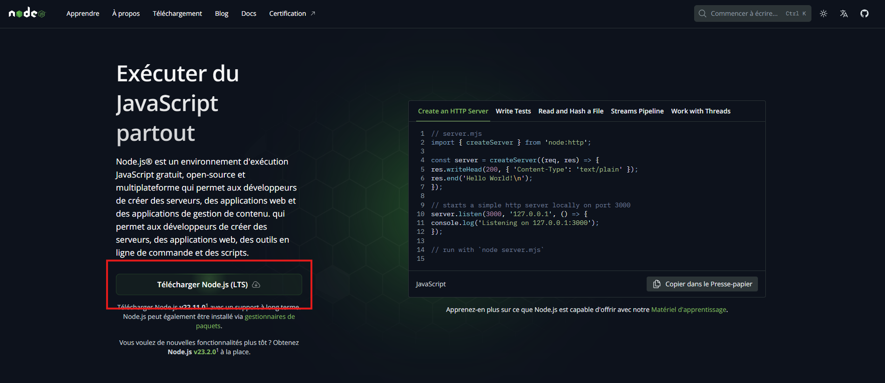

1) Install Node.js

    - **Windows**: Follow the installation wizard.
    - **Mac OS**: Drag and drop the Node.js installer into the ``Applications`` folder.
    - **Linux**: Follow the instructions specific to your distribution, available on the site.

2) During installation

    - Make sure the **npm package manager** option is selected.
    - Under Windows, accept the addition of Node.js to the **PATH**.

#### Step 3: Verify installation

After installation, reopen your terminal and verify the installed versions:

```bash
node -v
npm -v
```

### Install Composer

Run the following commande :

```bash
composer install
```

### Install Symfony CLI

**_(Windows only)_** If not installed, download **scoop** by running the following commands in a **PowerShell terminal** :
```powershell
Set-ExecutionPolicy -ExecutionPolicy RemoteSigned -Scope CurrentUser
Invoke-RestMethod -Uri https://get.scoop.sh | Invoke-Expression
```

Then run the command that you can find on the Symfony website, : [Symfony CLI](https://symfony.com/download) (be careful to run the command according to your OS).


### Configuring database access

1) Copy the ``.env`` file to ``.env.local`` at the root of your project.

2) Modify the following line to adapt it to your phpmyadmin logins/mdp

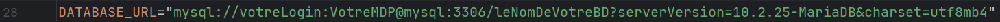

>  💡 If you don't have a DB, it will be created with “yourBDName” in all cases.

### Create the fixtures

Run the following command :

```bash
composer db
```

### Launch the local server in dev environment

Run the following command :

```bash
composer start-dev
```

## 📝 Composer scripts

To run a composer script, use the following command :

```bash
composer script_name
```

Here are the available scripts :
- `"start"` : Run symfony server
- `"start-dev"` : Run Symfony server in background and watch for changes in assets (e.g., CSS, JS) during development
- `"fix:twigcs"` : Fix Twig code with Twig CS Fixer
- `"test:twigcs"` : Test Twig code with Twig CS Fixer
- `"fix:phpcs"` : Fix PHP code with PHP CS Fixer
- `"test:phpcs"` : Test PHP code with PHP CS Fixer
- `"test:codeception"` : Initialize a database for tests before running all the tests
- `"test"` : Run every test script (Twig, PHP, Codeception)
- `"db"` : If it exists, delete the database and create a new one along with fake data
- `"npm install"` : This command installs all necessary dependencies (e.g. Tailwind CSS, Webpack Encore)
- `"npm run build"` : This will generate the necessary files in the public/build folder

## 🏗️ Project Architecture

### 📁 Main Structure

```bash
├── assets/            # CSS/JS assets
├── config/            # Symfony configuration
├── migrations/        # Doctrine migrations
├── public/            # Public files (images, CSS, JS)
├── src/               # PHP source code
│   ├── Controller/        # Controllers
│   ├── DataFixtures/      # Fake data
│   ├── Entity/            # Doctrine entities
│   ├── EventListener/     # Event listeners
│   ├── Factory/           # Factories
│   ├── Form/              # Symfony forms
│   ├── Repository/        # Doctrine repositories
│   └── Security/          # Security classes
├── templates/         # Twig templates for views
├── tests/             # Automated tests
├──.env                # Environment variables
├── composer.json      # Composer dependencies
├── package.json       # NPM dependencies
├── webpack.config.js  # Webpack Encore configuration
├── tailwind.config.js # Tailwind CSS configuration
├── .gitignore         # Files to ignore in Git
└── README.md          # Project documentation
```

### 🗄️ Data Model

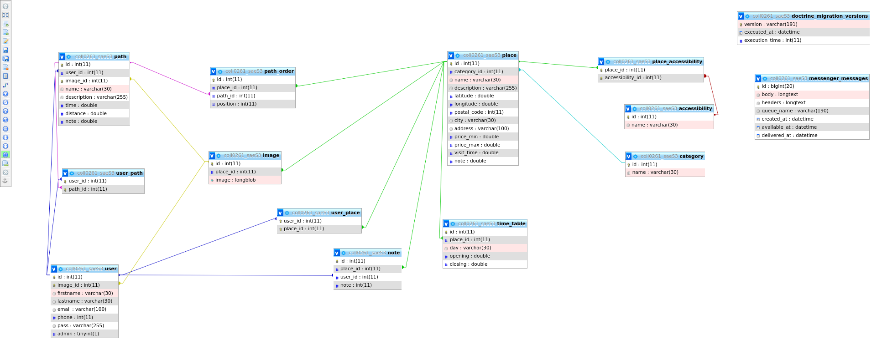

- **User** : Represents a user of the application.
- **Place** : Represents a place.
- **Category** : Represents a category of places.
- **Itinerary** : Represents an itinerary.
- **PathOrder** : Represents the order of the places in an itinerary.
- **Accessibility** : Represents the accessibility of a place, means put in place for disabled people.
- **Rating** : Represents the rating of a place by a user.
- **TimeTable** : Represents the timetable of a place.
- **Image** : Represents an image of a place.

All information about time are stored in minutes, and distances are stored in meters.

## 📸 Screenshots

### Home page

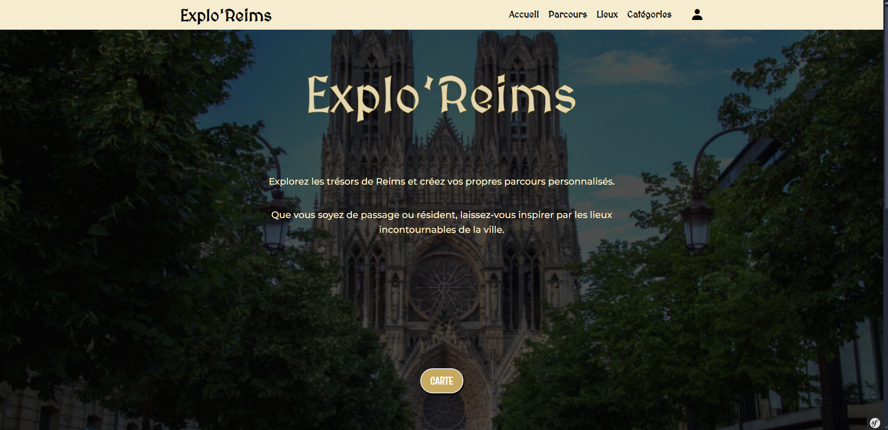

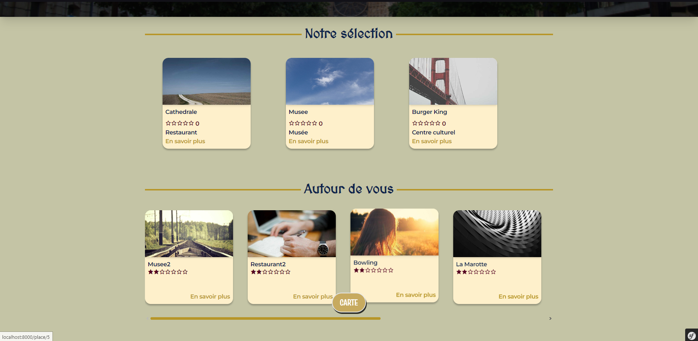

On the home page, you can see some places that are selected by the admin, and also places that are nearby the user (if he allows the geolocation).  
There is a navigation bar at the top of the page with :
- links to the main pages of the site (Places, Itineraries, Categories)
- a search bar to search for a place
- a button to log in or register

There also is a button to display the map with all the places.

### Map page

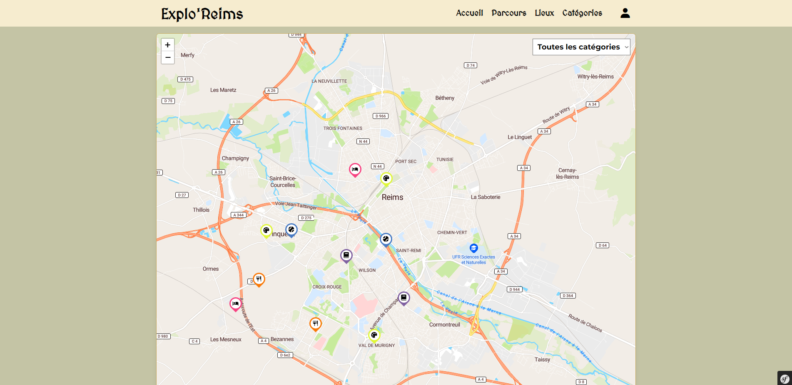
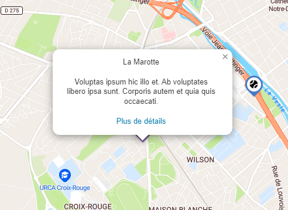

On the map page, you can see all the places in Reims. You can filter them by category and see the details of a place by clicking on it.

### Categories page

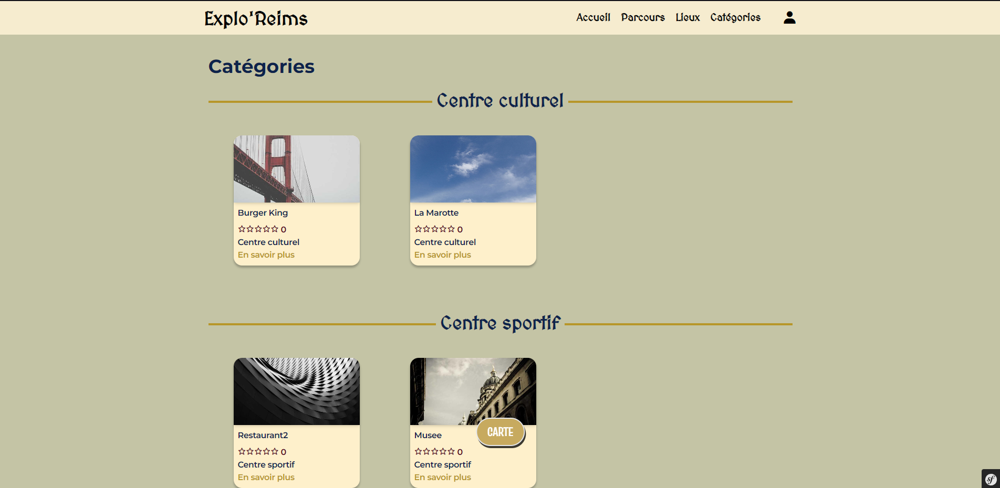

This page displays all the places sorted by categories.

### Places pages

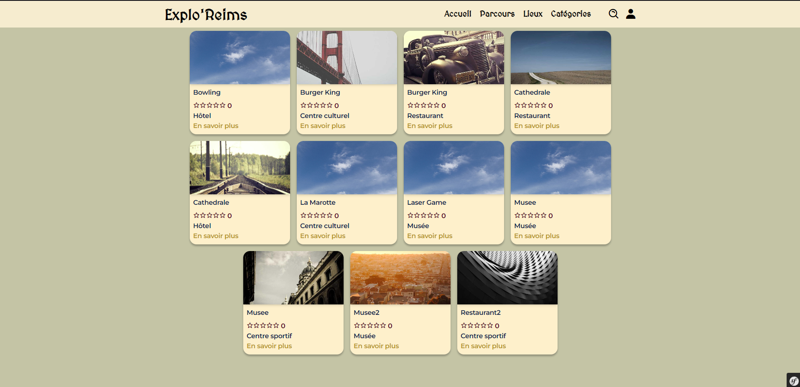

This page displays all the places in Reims. You can click on it to see the details of a place.

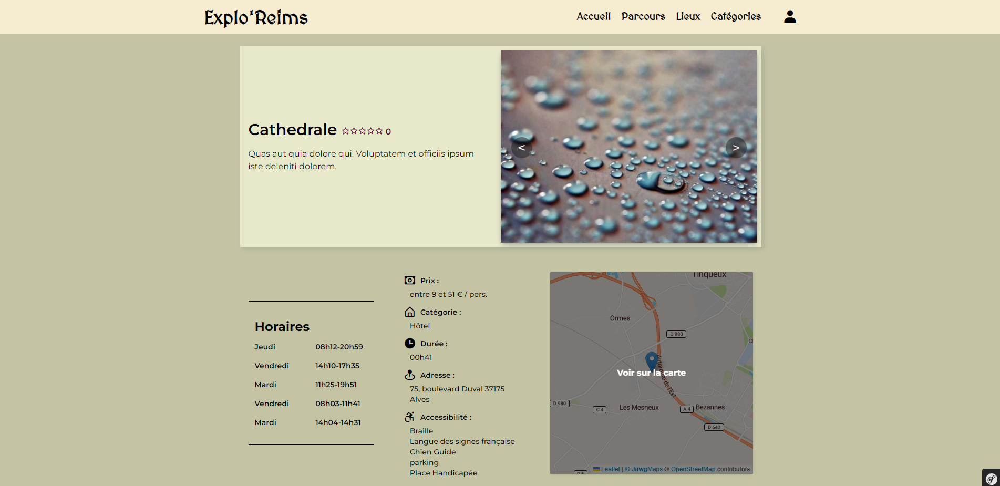

This page dislays the details of a place :
- name of the place
- rating
- description
- images (in a carousel)
- timetable
- price
- category
- duration of the visit
- address
- accessibility

There also is a button to see the place on the map. It will redirect you to the map page, centered on the place.

### Login/register page

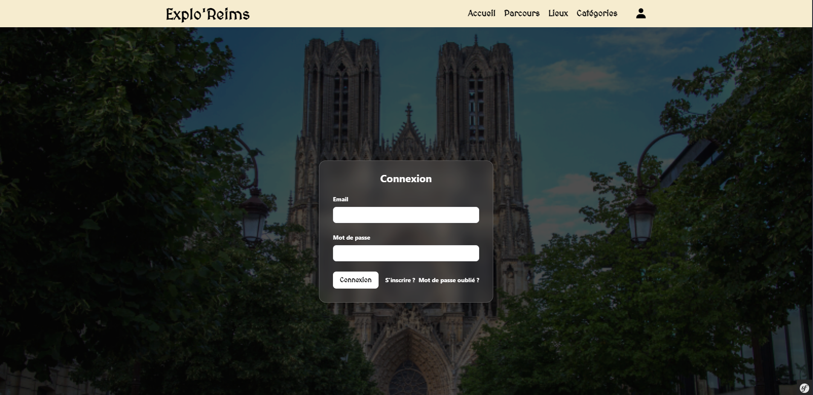

On this page, you can log in or register to the site.

### Itineraries pages

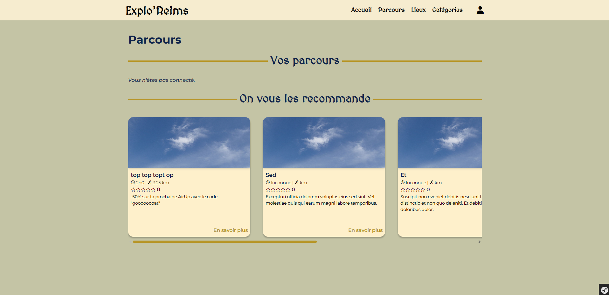

This page displays the most popular itineraries. You can click on it to see the details of an itinerary.
However, if oyu are not logged in, you don't have access to the creation of itineraries, or your own itineraries.

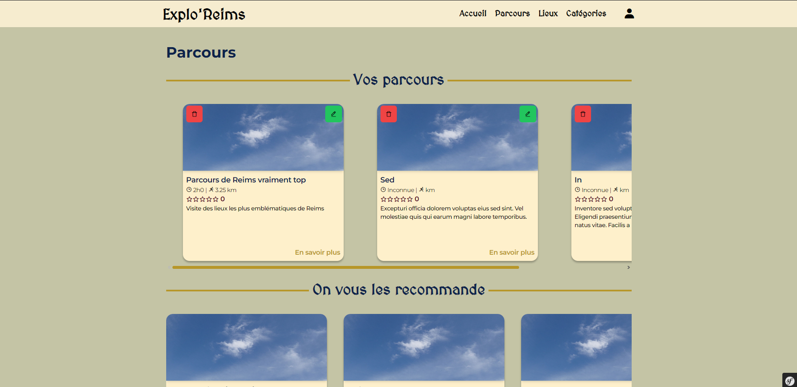

This is the same page, but when you are logged in. You can see your own itineraries, update them and create new ones.

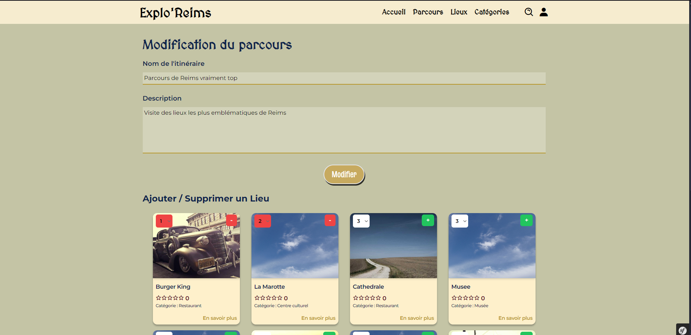

This is the form of the creation/update of an itinerary. You can add places to your itinerary by clicking on them in the list.
You can also change the order of the places by choosing the position of the place in the list.

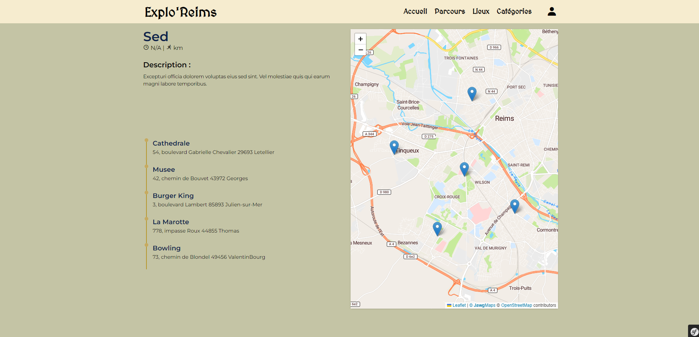

This page displays the details of an itinerary. You can see the places in the itinerary, the distance and the total duration of the itinerary.


### Back office

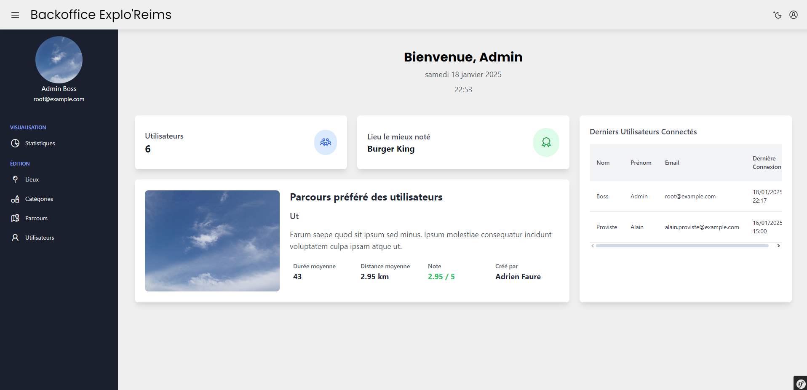

This is the dashboard of the admin. You can see some statistics about the site such as the number of users, the favourite place/itinerary and the last registered users.

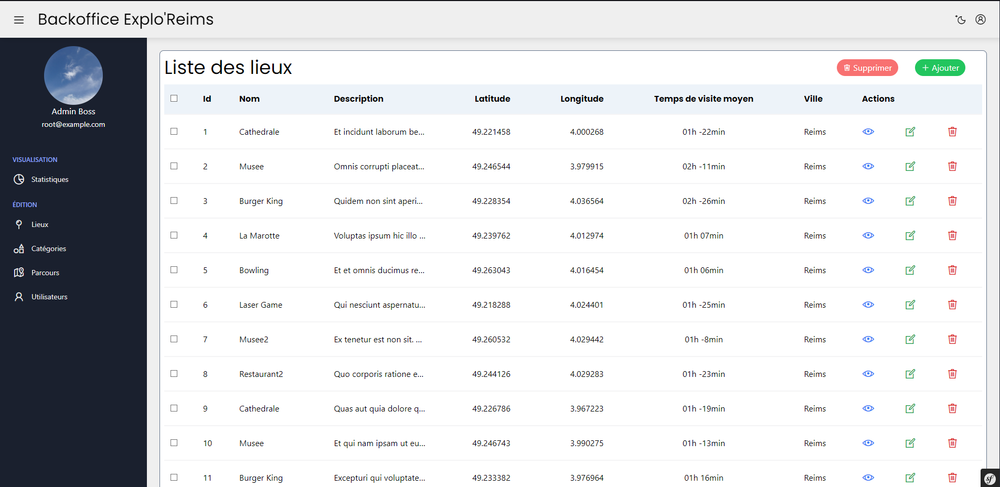

This page displays the list of places.
- You can create a new place by clicking on the button "+ Ajouter".
- You can update a place by clicking on the green edit button.
- You can delete a place by clicking on the red trash button.
- You can see the details of a place by clicking on the blue eye button.

You can also choose as many places as you want and delete them all at once by clicking on the "Supprimer" button at the top of the page.

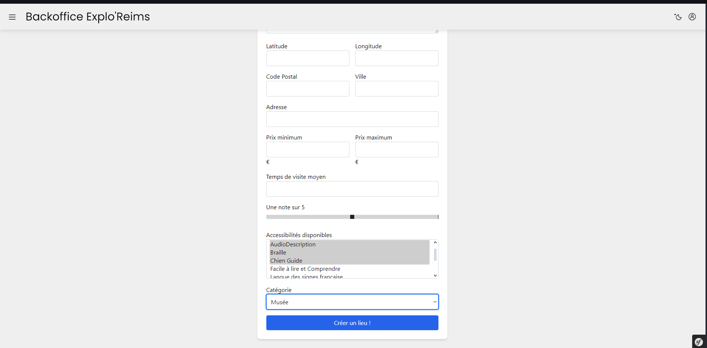

Creation form of a place.

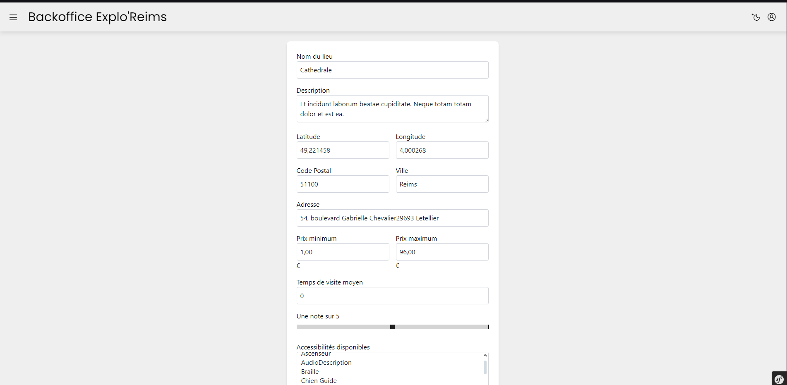

Updating form of a place.

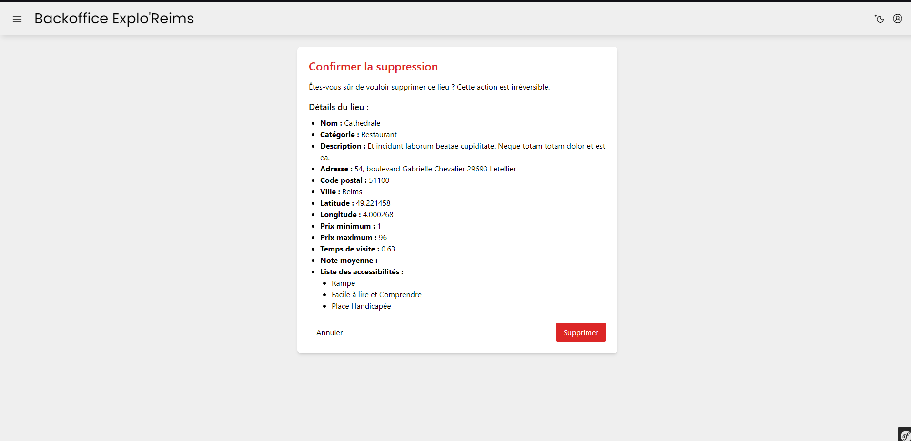

Deletion confirmation of a place when you click on the red trash button.

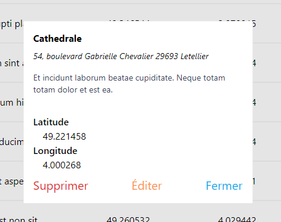

Details of a place when you click on the blue eye button.

The same principle applies to the categories, itineraries and users.

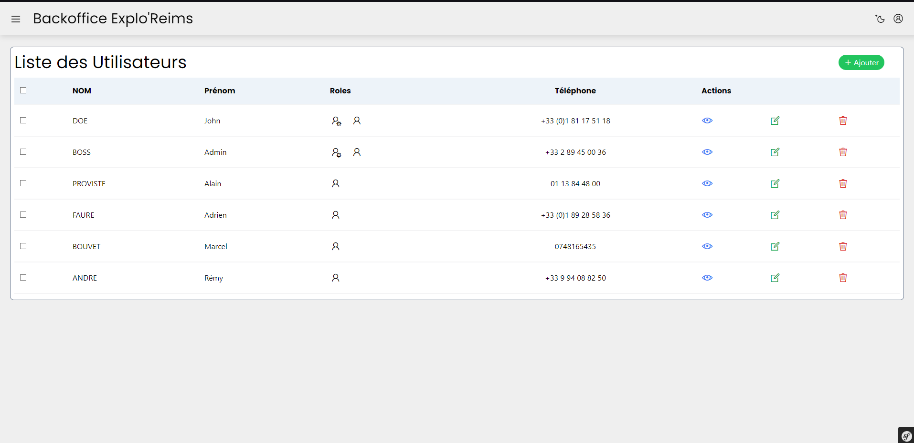

A notable difference is that you can see the roles of the users.
